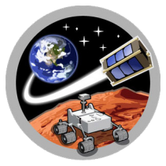

    

# Solar Balloon
The accompanying paper for this code was presented at AAS GNC 2020 and is published here: 
https://www.researchgate.net/publication/338936020_Altitude_Control_of_a_Solar_Balloon_for_Mars_Exploration

## Overview

This model is used to predict the altitude trajectory of a solar balloon on Mars.  Parameters such as balloon size, envelope material properties, deployment location, Sol and time, etc. can all be adjusted in **config.py** to perform simulations.

A plotting example to show how to use the code is available in **plots.py**.

## In Development

A solar balloon trajectory model for Earth is under developement. 

## Authors

* **Tristan Schuler** - *University of Arizona* 

## Acknowledgments

Hat Tip to [Bovine Aerospace](https://bovineaerospace.wordpress.com/), who developed a Solar Balloon Trajectory Model for Earth in C++. This code was adapted from their [repo](https://github.com/tunawhiskers/balloon_trajectory).

